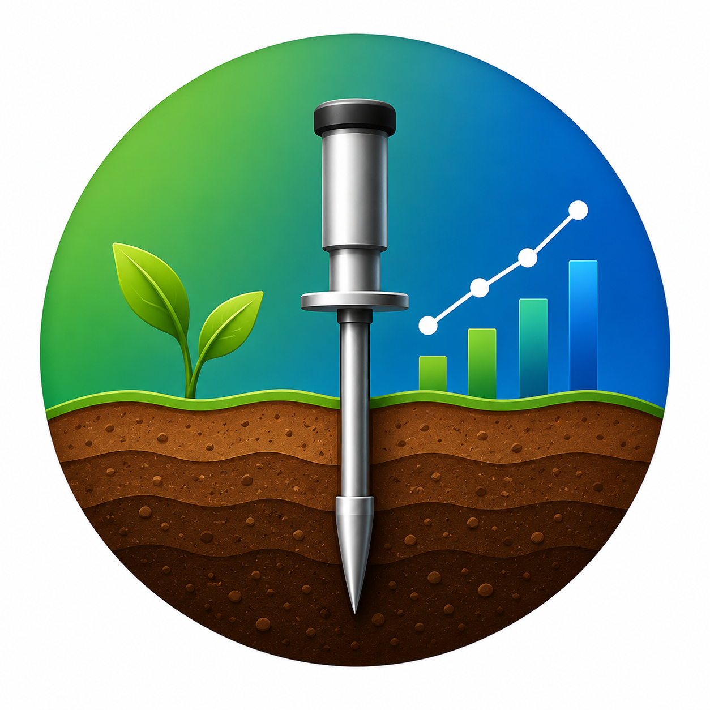

<p align="center">
  
</p>

<p align="center">
  
  
  
  
  
</p>

<p align="center">
App Android em Flutter para medicao e analise de compactacao do solo, migrado do sistema desktop Penetrometer Project (IF Goiano, Campus Hidrolandia). Offline-first, integrado ao Google Drive do usuario, pronto para a Play Store.
</p>

---

## Estrutura do Projeto

```
penetrometreMobile/
├── docs/           Diagnostico, decisao tecnica, arquitetura, seguranca, build e publicacao
├── app/            Projeto Flutter (lib/, test/, android/, assets/)
├── _analysis/      Clone do desktop original para engenharia reversa (nao versionado)
└── README.md
```

## Hub de Documentacao

- **[Diagnostico do Desktop](docs/01-DIAGNOSTICO.md)**: engenharia reversa, logica de negocio fiel ao codigo original, riscos e esforco.
- **[Decisao Tecnologica](docs/02-DECISAO-TECNOLOGICA.md)**: Flutter vs React Native e a stack definitiva escolhida.
- **[Arquitetura e Plano](docs/03-ARQUITETURA-E-PLANO.md)**: Clean Architecture, modelo de dados e fases F0-F9.
- **[Build no Android Studio](docs/04-BUILD-ANDROID-STUDIO.md)**: passo a passo para abrir, rodar e compilar o app.
- **[Seguranca](docs/05-SEGURANCA.md)**: SQLCipher, backup cifrado, secure storage e auditoria.
- **[Google Drive](docs/06-GOOGLE-DRIVE.md)**: fluxo de sincronizacao e configuracao do OAuth Client.
- **[Build e Publicacao](docs/07-BUILD-E-PUBLICACAO.md)**: assinatura, geracao de APK/AAB e checklist da Play Store.
- **[Politica de Privacidade](docs/08-POLITICA-DE-PRIVACIDADE.md)** e **[Termos de Uso](docs/09-TERMOS-DE-USO.md)**.
- **[Roadmap](docs/10-ROADMAP.md)**: melhorias futuras e manutencao.
- **[Checklist de Qualidade](docs/11-CHECKLIST-QUALIDADE.md)**: estado de verificacao do projeto.

## Estado Atual

Fases F0 a F9 concluidas e verificadas: `flutter analyze` sem apontamentos e suite de testes automatizados passando (dominio cientifico, relatorios, criptografia, repositorio e navegacao). APK e AAB de release assinados ja gerados em `app/build/app/outputs/`.

Pendencias que dependem do cliente: troca da senha do keystore de release, criacao das credenciais OAuth do Google Cloud para o Drive, e preenchimento da ficha da Play Console.

## Quick Start

Pre-requisitos: Flutter SDK 3.27+ e Android SDK (ver [guia completo](docs/04-BUILD-ANDROID-STUDIO.md)).

```bash
cd app
flutter pub get
dart run build_runner build --delete-conflicting-outputs
flutter test          # suite de testes automatizados
flutter run            # executa em emulador ou dispositivo
```

---

Sob licenca MIT. Mantida do projeto original ([Penetrometer Project](https://github.com/ThyagoToledo/penetrometre), IF Goiano - Campus Hidrolandia).
